# WebRTC NAT Traversal: Comprehensive Research Guide

## Current Application Status

Your application already implements many advanced WebRTC features:

✅ **Implemented Features:**
- Same-NAT detection and relay fallback
- Screen sharing with audio mixing
- Connection quality indicators
- Device detection (mobile/desktop/tablet)
- Camera switching during calls
- Responsive video layouts (grid, spotlight, gallery)
- Audio context management
- Debug tools and comprehensive logging
- Device session management
- Permission-based call joining

⚠️ **Potential Improvements:**
- Bandwidth adaptation algorithms
- Background noise suppression
- Echo cancellation tuning
- Call recording functionality
- Advanced video quality settings implementation
- Network change handling
- Battery optimization for mobile

---

## 1. Core WebRTC NAT Traversal Problems & Solutions

### Common Problems:
- **Symmetric NAT**: Both peers behind restrictive NATs
- **Hairpin NAT**: Same network peers can't connect via external IP
- **Firewall Blocking**: Corporate firewalls block UDP traffic
- **TURN Server Costs**: Relay bandwidth expenses

### Solutions:


## 2. ICE Connection State Machine

### Common Problems:
- **ICE Gathering Timeout**: Slow STUN server response
- **Connectivity Check Failures**: Blocked UDP ports
- **Candidate Pair Selection**: Suboptimal route choice

### ICE State Diagram:


## 3. STUN/TURN Server Architecture

### Common Problems:
- **STUN Server Overload**: High query volumes
- **TURN Bandwidth Costs**: Media relay expenses
- **Geographic Latency**: Distant relay servers
- **Authentication Issues**: Credential management

### Server Selection Strategy:

```mermaid
graph LR
    A[Client] --> B{Network Test}
    B --> C[Direct Connection Test]
    B --> D[STUN Query]
    B --> E[TURN Authentication]
    
    C --> F{Success?}
    F --> G[P2P Mode] --> H[✅ Optimal]
    F --> I[Try STUN]
    
    D --> J{NAT Type}
    J --> K[Full Cone] --> G
    J --> L[Symmetric] --> M[TURN Required]
    
    E --> M --> N[Relay Mode] --> O[💰 Expensive]
    
    style H fill:#99ff99
    style O fill:#ff9999
```


## 4. Enterprise Firewall Traversal

### Common Problems:
- **UDP Blocking**: Corporate policies block UDP
- **Deep Packet Inspection**: DPI blocks WebRTC packets
- **Proxy Requirements**: HTTP-only network access
- **Port Restrictions**: Limited port ranges

### Enterprise Solutions:


## 5. Mobile Network Challenges

### Common Problems:
- **Carrier-Grade NAT (CGN)**: Multiple NAT layers
- **IPv6 Transition**: Dual-stack complexity  
- **Battery Optimization**: OS killing connections
- **Network Switching**: WiFi ↔ Cellular handoffs

### Mobile Connection Flow:


## 6. Same-Network Detection & Resolution

### Your Implementation Pattern:


## 7. Connection Quality Optimization

### Common Problems:
- **Bandwidth Estimation Errors**: Poor quality adaptation
- **Jitter Buffer Issues**: Audio/video sync problems
- **Packet Loss Recovery**: Insufficient FEC/retransmission
- **Route Optimization**: Suboptimal network paths

### Quality Management:


## 8. Multi-Party Call Architecture

### Common Problems:
- **N² Connections**: Mesh topology scaling issues
- **Bandwidth Multiplication**: Each peer sends to all
- **Mixed Network Types**: Some P2P, some relay
- **Synchronization**: Media timing across peers

### Scaling Solutions:


## 9. Security & Privacy Considerations

### Common Problems:
- **TURN Credential Theft**: Long-lived credentials exposed
- **Media Interception**: Relay server access to streams  
- **DTLS Certificate Validation**: Weak certificate checks
- **Signaling Security**: Unencrypted offer/answer

### Security Architecture:


## 10. Performance Monitoring & Debugging

### Key Metrics to Track:
- **Connection Establishment Time**: ICE gathering + checking duration
- **Media Quality Metrics**: RTT, jitter, packet loss, bitrate
- **Relay Usage Rate**: Percentage of connections using TURN
- **Geographic Distribution**: Connection patterns by region

### Monitoring Dashboard Flow:

```mermaid
graph LR
    A[WebRTC Stats API] --> B[Real-time Metrics]
    B --> C[Connection Health]
    B --> D[Media Quality]
    B --> E[Network Topology]
    
    C --> F{Connection Type}
    F --> G[P2P Direct] --> H[✅ Optimal]
    F --> I[STUN Assisted] --> J[✅ Good]  
    F --> K[TURN Relay] --> L[⚠️ Expensive]
    F --> M[Failed] --> N[❌ Debug Required]
    
    D --> O[Bitrate Trends]
    E --> P[NAT Type Distribution]
    
    style H fill:#99ff99
    style L fill:#ffcc99
    style N fill:#ff9999
```


## 11. Device Management & Cross-Platform Compatibility

### Your Implementation Features:
- **Device Detection**: Mobile/Desktop/Tablet classification
- **Camera Management**: Dynamic device switching during calls  
- **Screen Sharing**: With audio mixing support
- **Session Management**: Device registration and tracking

### Additional Considerations:


## 12. Media Processing & Quality Control

### Your Current Implementation:
- **Connection Quality Indicators**: Real-time signal strength display
- **Screen Share Audio Mixing**: System audio + microphone
- **Camera Switching**: Mid-call device changes
- **Debug Tools**: Stream status monitoring

### Advanced Media Processing:


## 13. Permission Management & Security

### Your Implementation:
- **Host-Based Permissions**: Call join requests
- **Device Session Validation**: Socket-based authentication
- **Media Access Control**: Camera/microphone permissions

### Security Architecture:


---

## Research Topics for Deep Dive

### Core WebRTC Research Areas

**1. NAT Traversal Mechanisms**
- ICE (Interactive Connectivity Establishment) protocol
- STUN (Session Traversal Utilities for NAT) server behavior
- TURN (Traversal Using Relays around NAT) relay mechanisms
- Symmetric vs Cone NAT classifications

**2. Hairpin NAT / NAT Loopback**
- Router firmware implementations of hairpin NAT support
- UPnP and NAT-PMP port mapping protocols
- IPv6 transition and NAT64/DNS64 implications
- Enterprise firewall traversal strategies

### Advanced Technical Areas

**3. WebRTC Connection Establishment**
- SDP (Session Description Protocol) offer/answer model
- ICE candidate gathering and connectivity checks
- DTLS (Datagram Transport Layer Security) over SRTP
- Media path optimization vs signaling path separation

**4. Network Topology Detection**
- RTCPeerConnection.getStats() API for connection analysis
- Candidate pair state machines and priority algorithms
- Network interface enumeration and route selection
- Bandwidth estimation and adaptive bitrate algorithms

### Industry Implementation Studies

**5. Commercial Platform Architectures**
- Google Meet's selective forwarding unit (SFU) hybrid approach
- Zoom's media routing and relay strategies
- Discord's voice chat optimization techniques
- Jitsi Meet's open-source WebRTC implementation patterns

**6. Enterprise Solutions**
- Cisco Webex media processing architecture
- Microsoft Teams media stack and Azure relay infrastructure
- AWS Chime SDK's connectivity resolution strategies
- Twilio Video's global TURN server deployment

### Emerging Research Areas

**7. Next-Generation Protocols**
- WebRTC-NV (New Version) proposals
- QUIC integration with WebRTC data channels
- HTTP/3 impact on WebRTC signaling
- Machine learning for optimal relay selection

**8. Mobile and Edge Computing**
- 5G network slicing for WebRTC optimization
- Edge computing TURN server placement strategies
- Battery optimization for mobile WebRTC applications
- Cross-platform compatibility (iOS/Android/Desktop)

### Performance and Reliability

**9. Connection Quality Metrics**
- RTT (Round Trip Time) measurement and optimization
- Packet loss detection and recovery mechanisms
- Jitter buffer algorithms for audio/video synchronization
- Connection failover and redundancy strategies

**10. Security and Privacy**
- DTLS certificate validation in relay scenarios
- TURN server authentication and credential management
- Media encryption key exchange optimization
- Privacy implications of relay server usage

### 11. Your Application-Specific Research Areas

**Current Advanced Features (Already Implemented):**
- Screen sharing with system audio mixing
- Real-time connection quality indicators with visual feedback  
- Dynamic camera switching during active calls
- Cross-platform device detection (mobile/desktop/tablet)
- Host-based permission system for call joining
- Comprehensive debug tools and connection monitoring
- Responsive video layouts with multiple view modes
- Device session management with socket authentication

**Further Research Topics for Your Application:**
- **WebAudio API Advanced Processing**: Real-time audio effects, echo cancellation tuning
- **Canvas-Based Video Processing**: Filters, backgrounds, video effects
- **Progressive Web App (PWA)**: Offline capabilities, background notifications
- **WebAssembly Integration**: Performance-critical media processing
- **Battery Optimization Strategies**: Mobile background mode, power-efficient encoding
- **Network Adaptation Algorithms**: Dynamic quality adjustment based on conditions
- **Call Recording and Playback**: Media recording API, cloud storage integration
- **AI-Enhanced Features**: Noise suppression, automatic transcription, sentiment analysis

### 12. Application Architecture Patterns

**Your Current Implementation Pattern:**
```typescript
// Service-driven architecture with reactive state management
EnhancedVoiceCallService {
  // WebRTC connection management
  // Same-NAT detection and fallback
  // Screen sharing with audio mixing
  // Device detection and session management
  // Real-time quality monitoring
}
```

**Scaling Considerations:**
- Microservices for different media processing tasks
- CDN integration for TURN server distribution
- Load balancing for multiple concurrent calls
- Database optimization for call history and analytics

---

## Implementation Best Practices

### 1. Progressive Connectivity Strategy
```typescript
// Industry-standard fallback pattern
const connectionStrategy = {
  phase1: 'Direct P2P attempt (0-5s)',
  phase2: 'STUN-assisted connection (5-15s)', 
  phase3: 'TURN relay fallback (15s+)',
  sameNAT: 'Skip to relay for same external IP'
};
```

### 2. Same-NAT Detection Logic
```typescript
// Your implementation follows industry best practices
if (localExternalIP === remoteExternalIP && retryCount > 0) {
  forceRelayMode = true; // Skip futile P2P attempts
}
```

### 3. Connection Health Monitoring
```typescript
// Monitor key WebRTC stats for debugging
const keyMetrics = [
  'iceConnectionState',
  'candidatePairs',
  'packetsLost', 
  'roundTripTime',
  'availableOutgoingBitrate'
];
```

### 4. Enterprise-Grade Fallbacks
```typescript
const enterpriseConfig = {
  iceTransportPolicy: 'all', // Try everything first
  iceCandidatePoolSize: 10,  // Pre-gather candidates
  bundlePolicy: 'max-bundle', // Minimize ports
  rtcpMuxPolicy: 'require'   // Single port per media
};
```

This comprehensive research guide covers all major WebRTC connectivity challenges with visual diagrams, implementation patterns, and research directions for further investigation.
